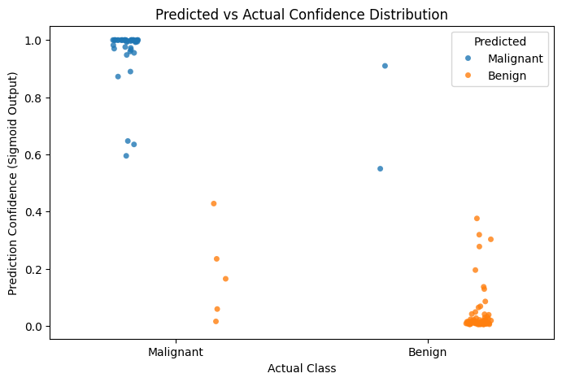
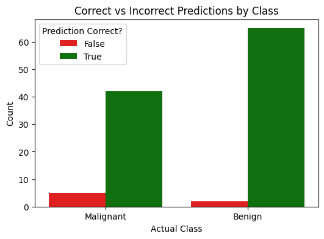

# CSC173 Activity 01 - Neural Network from Scratch

**Date:** October 09, 2025  
**Team:** Team Jinjin (Rey Iann V. Tigley)

## Project Overview

This project implements a simple neural network for binary classification using breast cancer diagnostic data. The network is built completely from scratch using only Python and NumPy, with no machine learning libraries. The goal is to deepen understanding of neural network fundamentals including forward propagation, loss computation, backpropagation, gradient descent training, and model evaluation.

## Data Preparation

I used the Breast Cancer Wisconsin Diagnostic dataset obtained from these sources:

- [Scikit-learn breast cancer dataset](https://scikit-learn.org/stable/modules/generated/sklearn.datasets.load_breast_cancer.html)
- [UCI Machine Learning Repository (Breast Cancer Wisconsin Diagnostic)](https://archive.ics.uci.edu/dataset/17/breast+cancer+wisconsin+diagnostic)

I selected two features from the dataset for the input layer of the network.

## Network Architecture

- Input layer: 2 neurons (corresponding to selected features)
- Hidden layer: 2 to 4 neurons, activation function: Sigmoid, ReLU, or Tanh
- Output layer: 1 neuron to produce binary classification output

## Implementation Details

- Weight and bias parameters initialized randomly.
- Forward propagation implements layer-wise computations with chosen activation functions.
- Loss computed using Mean Squared Error (MSE).
- Backpropagation calculates gradients of weights and biases.
- Parameters updated using gradient descent.
- Training performed for 500 to 1000 iterations.

## Results & Visualization

```
TRAINING SET RESULTS

Training Accuracy: 94.95%
Correct predictions: 432/455
```

```
TESTING SET RESULTS

Testing Accuracy: 93.86%
Correct predictions: 107/114
```

```
FIRST 10 TEST PREDICTIONS

Sample 1: Predicted=Malignant (1.000), Actual=Malignant
Sample 2: Predicted=Malignant (0.999), Actual=Malignant
Sample 3: Predicted=Benign (0.008), Actual=Benign
Sample 4: Predicted=Malignant (0.997), Actual=Malignant
Sample 5: Predicted=Malignant (1.000), Actual=Malignant
Sample 6: Predicted=Benign (0.032), Actual=Benign
Sample 7: Predicted=Benign (0.009), Actual=Benign
Sample 8: Predicted=Benign (0.011), Actual=Benign
Sample 9: Predicted=Malignant (1.000), Actual=Malignant
Sample 10: Predicted=Benign (0.006), Actual=Benign
```




## Team Collaboration

I am the only member so I contributed to 100% of the output:

- Weight and bias initialization
- Forward propagation coding
- Loss function implementation
- Backpropagation and gradient computation
- Training loop and visualization

## How to Run

1. Clone the GitHub repository:
   ```
   git clone https://github.com/noneiann/CSC173Assignment1_Neural_Network_Tigley.git
   ```
2. Open the Jupyter notebook or Colab file.
3. Run all cells sequentially.
4. Explore training loss plot and decision boundary visualizations.

## Summary

This activity provided hands-on experience in constructing a neural network from scratch without the use of high-level machine learning frameworks. I independently developed the model, analyzed its training behavior through visualizations, and demonstrated a clear understanding of fundamental AI concepts through both coding and documentation.

The activity helped me both understand how machine learning models work on a deeper, more theoretical level, while also helping me hone my algorithmic programming skills, where I had to code lots of mathematical formulas into python.

Video: [link](https://drive.google.com/file/d/1nFaIlOZlFfzdhq2ljocpdHaRPBysoyij/view?usp=sharing)
